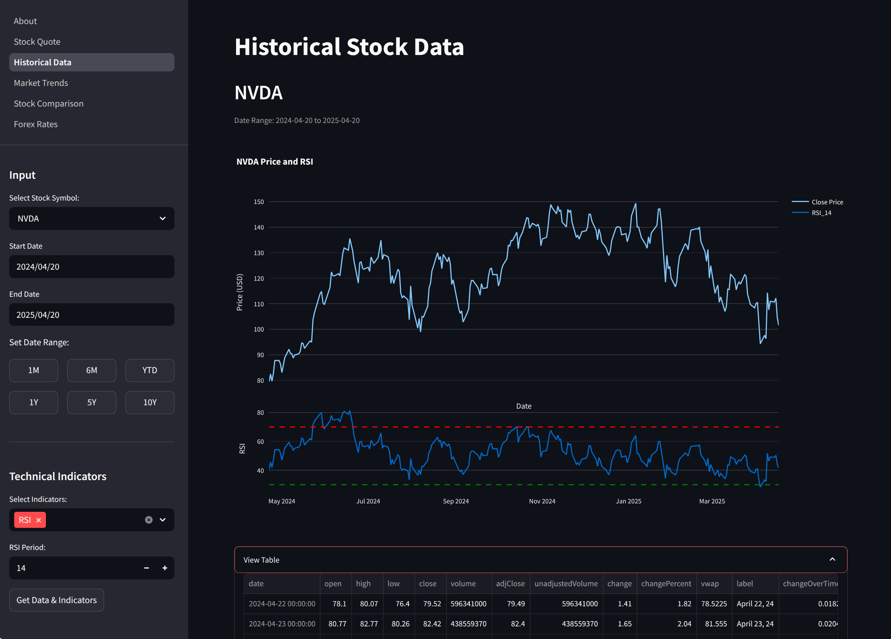

# Monetrix

Monetrix is a Streamlit dashboard for stock and forex market data. It uses Financial Modeling Prep
(FMP) for quotes and historical price series, then visualizes results in an interactive UI.



## Features

- Stock quote view with day high/low, volume, and key metrics.
- Historical closing price charts with preset ranges (`1M`, `6M`, `YTD`, `1Y`, `5Y`, `10Y`) or
  custom dates.
- Daily market movers (top gainers and top losers).
- Side-by-side stock comparison for up to 5 symbols.
- Forex pair rates and price changes.

## Requirements

- Python `>= 3.11`
- Poetry
- API key from [Financial Modeling Prep (FMP)](https://site.financialmodelingprep.com/developer/docs/)

## Installation

1. Clone the repository:
   ```bash
   git clone https://github.com/aileks/monetrix.git
   cd monetrix
   ```

2. Set up the API key:
   - Local development (`src/.env`):
     ```bash
     cp src/.env.example src/.env
     ```
     ```env
     FMP_API_KEY="YOUR_FMP_API_KEY"
     ```
   - Streamlit Cloud (`.streamlit/secrets.toml`), either flat or nested:
     ```toml
     FMP_API_KEY = "YOUR_FMP_API_KEY"
     ```
     ```toml
     [fmp]
     api_key = "YOUR_FMP_API_KEY"
     ```

3. Install dependencies:
   ```bash
   poetry install
   ```

## Run

1. Start the app:
   ```bash
   poetry run streamlit run src/monetrix/app.py
   ```
2. Open `http://localhost:8501` (or the URL shown by Streamlit).

## Pages

- `About`: project overview.
- `Stock Quote`: single-symbol quote and key metrics.
- `Historical Data`: price chart plus optional SMA/EMA/RSI overlays computed locally from
  historical close prices.
- `Market Trends`: top gainers and losers.
- `Stock Comparison`: up to 5 symbols, side by side.
- `Forex Rates`: selected currency pair quotes.

## Dependencies

- Streamlit
- pandas
- Plotly
- Requests
- python-dotenv

## Data Attribution

Market data is provided by the Financial Modeling Prep (FMP) API.
